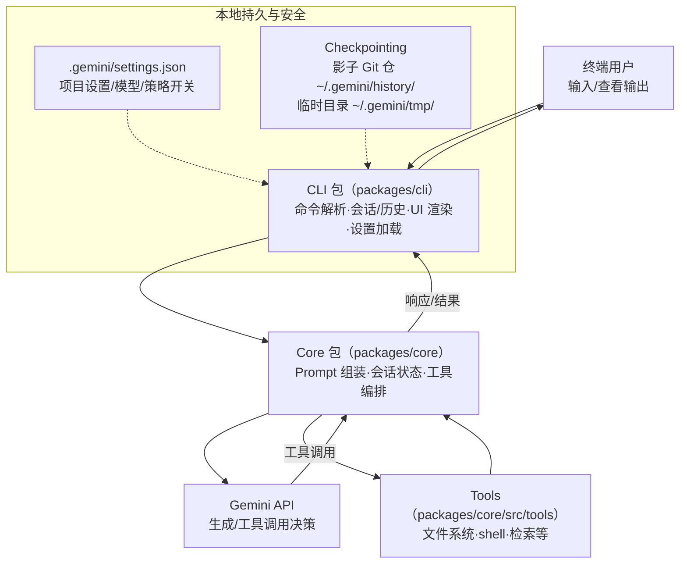

# Gemini CLI 架构（Mermaid）

```mermaid
flowchart TD
  User[终端用户<br/>输入/查看输出] --> CLI[CLI 包（packages/cli）<br/>命令解析·会话/历史·UI 渲染·设置加载]
  CLI --> Core[Core 包（packages/core）<br/>Prompt 组装·会话状态·工具编排]
  Core --> GeminiAPI[Gemini API<br/>生成/工具调用决策]
  GeminiAPI --> Core
  Core -->|工具调用| Tools[Tools（packages/core/src/tools）<br/>文件系统·shell·检索等]
  Tools --> Core
  Core -->|响应/结果| CLI
  CLI --> User

  subgraph LocalState[本地持久与安全]
    Settings[.gemini/settings.json<br/>项目设置/模型/策略开关] -.-> CLI
    Checkpoint[Checkpointing<br/>影子 Git 仓 ~/.gemini/history/<hash><br/>临时目录 ~/.gemini/tmp/<hash>] -.-> CLI
  end
```

> 依据 `docs/architecture.md`：CLI 负责输入/输出与用户体验，Core 负责与 Gemini
> API 交互并编排工具，Tools 执行具体环境操作；本地 settings 与 checkpointing 提供配置和可回滚能力。\*\*\*
