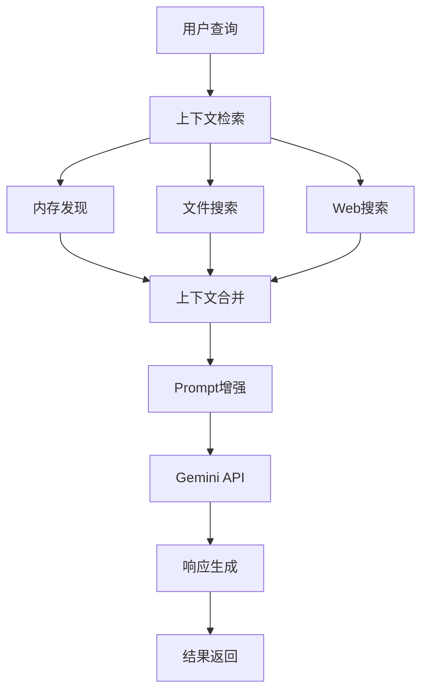

# Gemini CLI 学习指引

> 🚀 **一个完整的AI应用开发学习资源指南**  
> 本指南帮助你系统学习现代AI应用开发，特别是RAG技术和工具系统设计

## 📋 目录

- [项目概述](#项目概述)
- [RAG核心代码位置](#rag核心代码位置)
- [学习路径规划](#学习路径规划)
- [核心技术解析](#核心技术解析)
- [实践项目推荐](#实践项目推荐)
- [进阶学习资源](#进阶学习资源)

## 🎯 项目概述

**Gemini CLI** 是Google官方开源的AI命令行工具，展示了现代AI应用开发的最佳实践。

### 核心特性
- **RAG (检索增强生成)** 完整实现
- **模块化工具系统** 设计
- **智能上下文管理**
- **多模态AI应用**
- **MCP协议支持**
- **生产级安全机制**

### 技术栈
- **后端**: TypeScript + Node.js
- **前端**: React + Ink (CLI UI)
- **AI集成**: Google Gemini API
- **协议**: Model Context Protocol (MCP)

## 🧠 RAG核心代码位置

> ⚠️ **重要发现**: 这个项目没有使用传统的向量数据库！  
> 采用的是"智能文件发现 + 实时读取"的创新RAG策略

### 🎯 **RAG策略对比**

| 传统RAG | Gemini CLI RAG |
|---------|---------------|
| 向量数据库存储 | 实时文件读取 |
| 语义相似性搜索 | 路径/规则匹配 |
| 预处理向量化 | 零预处理开销 |
| 黑盒检索 | 透明文件引用 |

### 1. 内存系统 (Memory System)

#### **主要文件**: `packages/core/src/tools/memoryTool.ts`
```typescript
// 核心功能：
// - save_memory 工具实现
// - 长期记忆保存到 GEMINI.md
// - 支持层次化内存管理
```

**关键特性**:
- 无需向量化：直接文本存储
- 层次化组织：全局 → 项目 → 目录
- 导入机制：支持 `@path/to/file.md` 语法

### 2. 智能文件发现 (File Discovery)

#### **主要文件**: `packages/core/src/services/fileDiscoveryService.ts`
```typescript
// 核心功能：
// - Git感知的文件过滤
// - .geminiignore 自定义规则
// - 智能文件类型检测
```

**过滤策略**:
- ✅ Git规则：自动跳过 `.gitignore` 文件
- ✅ 自定义规则：支持 `.geminiignore`
- ✅ 类型过滤：跳过二进制文件

### 3. @命令处理器 (At Command Processor)

#### **主要文件**: `packages/cli/src/ui/hooks/atCommandProcessor.ts`
```typescript
// 核心功能：
// - 解析 @file.txt 语法
// - 实时读取文件内容
// - 智能路径解析和错误处理
```

**处理流程**:
1. **解析阶段**: 提取用户查询中的 `@path` 
2. **验证阶段**: 检查文件存在性和权限
3. **读取阶段**: 调用 `read_many_files` 工具
4. **注入阶段**: 将内容结构化注入到prompt

### 4. 内存发现机制 (Memory Discovery)

#### **主要文件**: `packages/core/src/utils/memoryDiscovery.ts`
```typescript
// 核心功能：
// - 层次化搜索 GEMINI.md 文件
// - 全局、项目、本地上下文管理
// - 智能文件路径解析
```

**搜索策略**:
1. **全局搜索**: `~/.gemini/GEMINI.md`
2. **向上搜索**: 从当前目录到项目根
3. **向下搜索**: 当前目录的子目录

### 5. 嵌入能力 (Embedding - 未使用于RAG)

#### **主要文件**: `packages/core/src/core/client.ts`
```typescript
// generateEmbedding() 方法存在但不用于RAG
// 可能为其他用途保留（如代码相似性分析）
```

### 6. 内存导入处理器 (Memory Import Processor)

#### **主要文件**: `packages/core/src/utils/memoryImportProcessor.ts`
```typescript
// 核心功能：
// - 支持 @path/to/file.md 语法
// - 防止循环导入
// - 递归处理导入链
```

**关键功能**:
- `processImports()` - 处理导入语句
- 循环导入检测
- 路径安全验证

### 7. 实时信息检索 (Real-time Information Retrieval)

#### **Web搜索**: `packages/core/src/tools/web-search.ts`
```typescript
// 使用 Google Search API
// 支持引用和来源链接
```

#### **网页抓取**: `packages/core/src/tools/web-fetch.ts`
```typescript
// URL内容获取
// 智能内容提取
```

## 🗺️ 学习路径规划

### 🌟 阶段一：项目架构理解 (1-2天)

**目标**: 理解整体架构和通信机制

**核心文件**:
```bash
docs/architecture.md           # 架构概述
docs/core/tools-api.md        # 工具API设计
packages/cli/src/gemini.tsx   # CLI入口
packages/core/src/core/client.ts  # 核心客户端
```

**关键概念**:
- CLI包 ↔ Core包通信机制
- 工具注册和发现流程
- 会话管理和状态保持

### 🔍 阶段二：RAG机制深入 (2-3天)

**目标**: 掌握RAG实现原理

**学习顺序**:
1. **内存工具** → `memoryTool.ts`
2. **内存发现** → `memoryDiscovery.ts`  
3. **导入处理** → `memoryImportProcessor.ts`
4. **上下文管理** → `core/prompts.ts`

**实践任务**:
```bash
# 1. 创建测试 GEMINI.md 文件
echo "# 项目说明\n这是一个测试项目" > GEMINI.md

# 2. 运行CLI体验内存功能
npm start
> 记住这个信息：我正在学习RAG技术

# 3. 查看生成的内存文件
cat ~/.gemini/GEMINI.md
```

### 🛠️ 阶段三：工具系统研究 (2-3天)

**目标**: 理解工具扩展机制

**核心文件**:
```bash
packages/core/src/tools/tools.ts           # 基础工具接口
packages/core/src/tools/tool-registry.ts   # 工具注册系统
packages/core/src/tools/mcp-client.ts      # MCP客户端
```

**学习重点**:
- `BaseTool` 抽象类设计
- 工具验证和执行流程
- MCP协议集成

### 🔧 阶段四：实现自定义工具 (3-5天)

**目标**: 开发自己的AI工具

**示例项目**: 创建天气查询工具
```typescript
// packages/core/src/tools/weather.ts
export class WeatherTool extends BaseTool<WeatherParams, ToolResult> {
  constructor() {
    super(
      'get_weather',
      'Weather Tool',
      'Get current weather information for a location',
      {
        type: 'object',
        properties: {
          location: {
            type: 'string',
            description: 'City name or coordinates'
          }
        },
        required: ['location']
      }
    );
  }

  async execute(params: WeatherParams): Promise<ToolResult> {
    // 实现天气API调用
    const weatherData = await fetchWeatherData(params.location);
    return {
      llmContent: `Weather in ${params.location}: ${weatherData.description}`,
      returnDisplay: `🌤️ ${weatherData.temperature}°C, ${weatherData.description}`
    };
  }
}
```

### 🚀 阶段五：高级特性探索 (3-5天)

**目标**: 掌握高级AI应用技术

**探索领域**:
1. **对话压缩机制** → `core/client.ts#tryCompressChat()`
2. **流式响应处理** → `core/geminiChat.ts`
3. **工具链编排** → `core/turn.ts`
4. **安全沙箱** → `utils/sandbox.ts`

## 🔬 核心技术解析

### RAG架构模式



### 内存层次结构

```
📁 内存层次
├── 🌐 全局内存 (~/.gemini/GEMINI.md)
├── 📦 项目内存 (project-root/GEMINI.md)  
├── 📂 目录内存 (current-dir/GEMINI.md)
└── 📄 文件内存 (@imports)
```

### 工具系统架构

```typescript
interface ToolSystemFlow {
  discovery: 'Static Registration' | 'MCP Discovery' | 'Command Discovery';
  validation: 'Schema Validation' | 'Parameter Check';
  execution: 'Sandboxed' | 'Direct';
  result: 'LLM Content' + 'Display Content';
}
```

## 🎯 实践项目推荐

### 项目1: 智能代码分析器
**难度**: ⭐⭐⭐
```typescript
// 实现功能：
// - 分析代码质量
// - 生成重构建议  
// - 识别潜在bug
```

### 项目2: 文档智能问答系统
**难度**: ⭐⭐⭐⭐
```typescript
// 实现功能：
// - 文档向量化
// - 语义搜索
// - 上下文感知回答
```

### 项目3: 多模态内容生成器
**难度**: ⭐⭐⭐⭐⭐
```typescript
// 实现功能：
// - 图像理解
// - 代码生成
// - 文档创建
```

## 📚 核心概念速查

### RAG关键术语
- **Retrieval**: 信息检索
- **Augmentation**: 信息增强
- **Generation**: 内容生成
- **Context Window**: 上下文窗口
- **Embedding**: 向量嵌入

### 工具系统术语
- **Tool Registry**: 工具注册表
- **Function Declaration**: 函数声明
- **MCP**: Model Context Protocol
- **Sandboxing**: 沙箱隔离
- **Tool Chain**: 工具链

## 🔗 进阶学习资源

### 官方文档
- [Gemini API 文档](https://ai.google.dev/gemini-api/docs)
- [MCP 规范](https://modelcontextprotocol.io/)
- [TypeScript 高级特性](https://www.typescriptlang.org/docs/)

### 相关技术
- **向量数据库**: Pinecone, Weaviate, Qdrant
- **LLM框架**: LangChain, LlamaIndex
- **AI工具**: AutoGPT, Agent框架

### 实战项目
- **Fork项目**: 在此基础上开发新功能
- **贡献代码**: 参与开源贡献
- **构建应用**: 基于学到的技术栈构建AI应用

## 🏁 总结

通过学习Gemini CLI项目，你将掌握：

1. **RAG技术的完整实现**
2. **模块化AI工具系统设计**
3. **生产级代码架构模式**
4. **现代AI应用开发实践**

这个项目是学习AI应用开发的绝佳起点，涵盖了从基础概念到高级实现的完整技术栈。

---

**💡 提示**: 建议边学习边实践，通过修改代码和实现新功能来加深理解。

**📞 社区支持**: 遇到问题可以查看项目的Issues和讨论区，或参与开源贡献。 