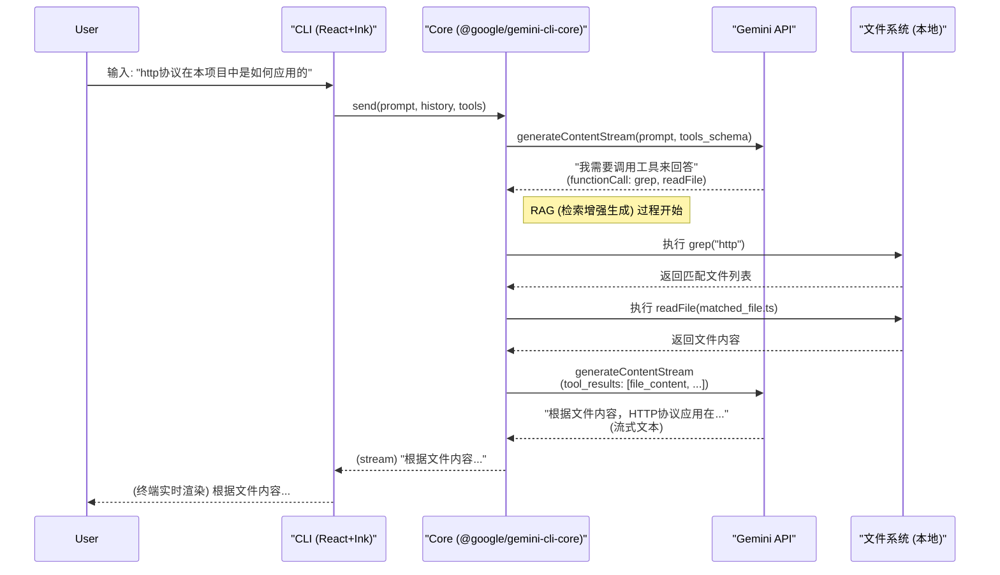

# Gemini CLI 请求生命周期全解析

> ❓ **一个问题从提出到解答，在代码世界里经历了怎样的旅程？**

本指南将以一个具体问题为例，深入剖析Gemini CLI从接收用户输入到返回最终答案的完整端到端代码执行流程。

**示例问题**：`"http协议在本项目中是如何应用的"`

---

## 📋 目录
- [流程概览图](#-流程概览图)
- [第一步：捕获用户输入 (UI层)](#-第一步捕获用户输入-ui层)
- [第二步：前端到核心的桥梁](#-第二步前端到核心的桥梁)
- [第三步：核心对话的启动 (Core层)](#-第三步核心对话的启动-core层)
- [第四步：首次API调用与RAG决策](#-第四步首次api调用与rag决策)
- [第五步：工具调度与执行 (RAG核心)](#-第五步工具调度与执行-rag核心)
- [第六步：二次API调用与答案生成](#-第六步二次api调用与答案生成)
- [第七步：流式响应与UI渲染](#-第七步流式响应与ui渲染)
- [总结](#-总结)

---

## 🗺️ 流程概览图



---

## ⚡ 第一步：捕获用户输入 (UI层)

-   **文件**: `packages/cli/src/ui/components/InputPrompt.tsx`
-   **核心逻辑**: 当用户按下回车键，`useKeypress` 这个Hook会捕获到事件，并调用 `handleSubmitAndClear` 函数。此函数的核心是执行从父组件 `App.tsx` 传入的 `onSubmit` 回调，并将用户输入的字符串作为参数。

```typescript
// packages/cli/src/ui/components/InputPrompt.tsx
export const InputPrompt = ({ onSubmit }) => {
  const handleSubmitAndClear = useCallback((submittedValue) => {
    buffer.setText('');
    onSubmit(submittedValue); // 关键：将输入向上传递
  }, [onSubmit, buffer]);

  // 当键盘事件为回车时
  if (key.name === 'return') {
    handleSubmitAndClear(buffer.text);
  }
};
```

---

## 🌉 第二步：前端到核心的桥梁

-   **文件**: `packages/cli/src/ui/App.tsx` 和 `packages/cli/src/ui/hooks/useGeminiStream.ts`
-   **核心逻辑**:
    1.  `App.tsx` 中的 `onSubmit` 方法接收到用户输入后，会调用 `geminiStream.send()`。
    2.  `geminiStream` 是 `useGeminiStream` Hook的实例，它的 `send` 方法是前端到后端的核心桥梁。
    3.  `send` 方法内部会调用 `config.getCore().chat.sendMessageStream()`，正式将请求发送到 `@google/gemini-cli-core` 包中进行处理。

```typescript
// packages/cli/src/ui/App.tsx
const App = () => {
  const geminiStream = useGeminiStream(config, ...);
  const onSubmit = useCallback(async (value) => {
    // ... 将用户输入添加到历史记录
    geminiStream.send({ contents: [{ role: 'user', parts: [{ text: value }] }]});
  }, [geminiStream]);
  
  return <InputPrompt onSubmit={onSubmit} ... />;
};
```

```typescript
// packages/cli/src/ui/hooks/useGeminiStream.ts
export function useGeminiStream(config) {
  const send = useCallback(async (request) => {
    // 关键连接点：调用Core的API
    const stream = config.getCore().chat.sendMessageStream(request);
    for await (const chunk of stream) {
      // 处理后续返回的数据流
    }
  }, [config]);
  
  return { send };
}
```

---

## 🚀 第三步：核心对话的启动 (Core层)

-   **文件**: `packages/core/src/core/geminiChat.ts`
-   **核心逻辑**: `GeminiChat` 类是对话管理的中枢。它的 `sendMessageStream` 方法接收到请求后，不会直接调用 `fetch`，而是通过一个抽象层 `contentGenerator` 来与Gemini API通信。这体现了良好的分层设计。

```typescript
// packages/core/src/core/geminiChat.ts
export class GeminiChat {
  async *sendMessageStream(params) {
    // ... 各种准备工作
    const streamResponse = this.contentGenerator.generateContentStream({
      contents: allContents,
      tools: this.tools,
      generationConfig: this.generationConfig,
    });
    // ... 处理返回的流
  }
}
```

---

## 🧠 第四步：首次API调用与RAG决策

-   **文件**: `packages/core/src/core/contentGenerator.ts`
-   **核心逻辑**: 这是实际发起HTTP请求的地方。它会将用户的提问、对话历史以及所有已注册工具的**Schema**（一种描述工具功能、参数的元数据）一起打包，发送给Gemini API。
-   **RAG决策**: Gemini模型接收到请求后，发现只靠自身知识无法回答“**本项目中**的http应用”，于是它做出决策：**我需要调用工具来查找本地代码**。API的响应不是一段文字，而是一个 `functionCall` 对象，请求CLI执行 `grep` 或 `glob` 等工具。

---

## 🛠️ 第五步：工具调度与执行 (RAG核心)

-   **文件**: `packages/core/src/core/coreToolScheduler.ts`
-   **核心逻辑**: `CoreToolScheduler` 接收到 `functionCall` 后，像一个任务调度中心一样开始工作。
    1.  **查找工具**: 从 `ToolRegistry` 中找到名为 `grep` 的工具实例。
    2.  **请求批准 (如需)**: 对于危险操作，会等待用户确认。对于 `grep` 这种只读工具，通常会自动执行。
    3.  **执行**: 调用 `GrepTool.execute()` 方法，在文件系统中执行搜索。
    4.  **收集结果**: 工具的输出（比如匹配到的文件列表和内容）被收集起来。

```typescript
// packages/core/src/core/coreToolScheduler.ts
export class CoreToolScheduler {
  async schedule(request) {
    // 1. 验证工具请求
    this.setStatusInternal(callId, 'validating');
    
    // 2. 查找工具
    const tool = await this.toolRegistry.get(request.name);

    // 3. 等待用户批准 (或自动通过)
    this.setStatusInternal(callId, 'awaiting_approval');
    
    // 4. 执行
    this.attemptExecutionOfScheduledCalls(signal);
  }
  
  private async executeTool(toolCall, signal) {
    const result = await toolCall.tool.execute(toolCall.request.args, ...);
    // ... 处理结果
  }
}
```

---

## 📡 第六步：二次API调用与答案生成

-   **文件**: `packages/core/src/core/geminiChat.ts`
-   **核心逻辑**: 工具执行的结果（包含“http”关键字的文件内容）被打包成一个 `functionResponse` 对象，通过 `sendMessageStream` **再次**发送给Gemini API。这一次，请求中包含了丰富的上下文信息。Gemini API会基于这些具体的文件内容，生成最终的自然语言回答。

---

## 🖥️ 第七步：流式响应与UI渲染

-   **文件**: `packages/cli/src/ui/hooks/useGeminiStream.ts` 和 `packages/cli/src/ui/components/messages/ModelMessage.tsx`
-   **核心逻辑**:
    1.  `useGeminiStream` 中的 `for await...of` 循环开始接收到来自Core的、包含最终答案的**文本数据流**。
    2.  每个数据块（chunk）都会通过 `handleNewMessage` 回调更新到 `App.tsx` 的状态中。
    3.  React的状态更新触发UI重新渲染，`ModelMessage.tsx` 等组件会将最新的文本流渲染到终端上，用户因此看到了打字机一样的实时输出效果。

---

## ✨ 总结

Gemini CLI通过一个设计精良的**双向通信和工具调用（RAG）循环**，实现了强大的交互能力。它并非简单地将问题抛给AI，而是赋予了AI一个可以操作本地环境的“身体”（工具集），并通过一个严谨的调度系统来确保这些操作是安全和高效的。这个流程完美地展示了现代AI应用中“代理（Agent）”的核心思想。 